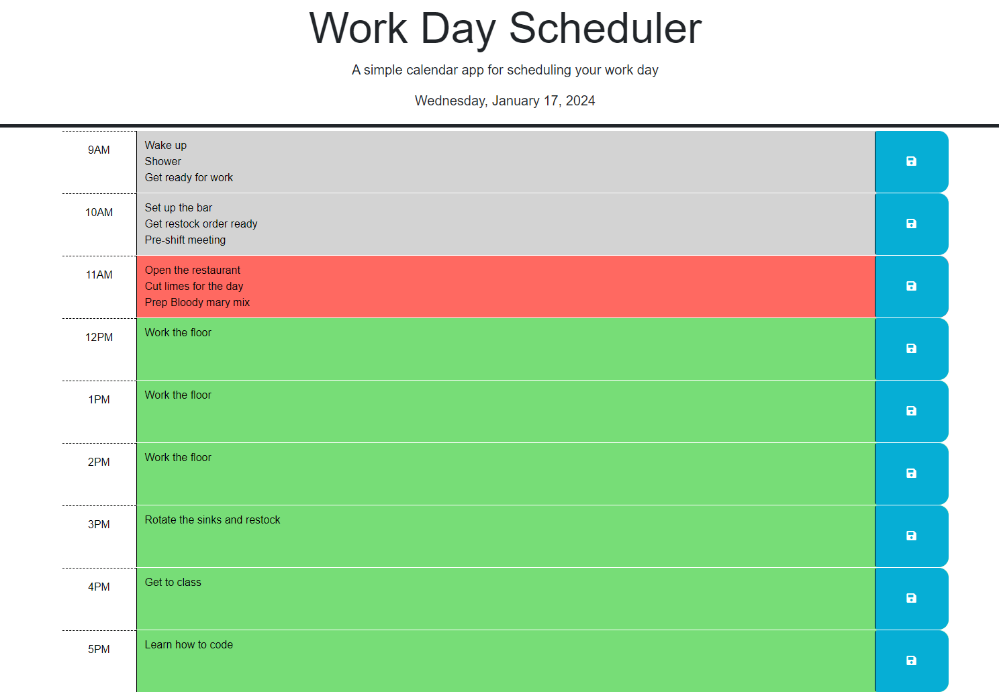

# Module 5 | Third-Party APIs | Work Day Scheduler

## Finished Product

### [🔗Project Link](https://tylerfruik.github.io/Work-Day-Scheduler/) 
This application presents an empty daily scheduler from the hours of 9AM to 5PM.
Users can enter their goings on each hour and press the save button. The next time the page is loaded, previously stored information will be conserved and displayed.
The current hour is highlighted in red, past hours in gray, future hours in green.

This project was developed using the following skills: HTML, CSS Bootstrap, JS, Third-Party APIs 

All code is neatly commented for clarity's sake.

All code refactored or written manually by Tyler Fruik.

### The following is an image of the final product:


## Assignment Information

### Mock-up


### User Story
```
AS AN employee with a busy schedule
I WANT to add important events to a daily planner
SO THAT I can manage my time effectively
```

### Acceptance Criteria
```
GIVEN I am using a daily planner to create a schedule
WHEN I open the planner
THEN the current day is displayed at the top of the calendar
WHEN I scroll down
THEN I am presented with time blocks for standard business hours of 9am to 5pm
WHEN I view the time blocks for that day
THEN each time block is color-coded to indicate whether it is in the past, present, or future
WHEN I click into a time block
THEN I can enter an event
WHEN I click the save button for that time block
THEN the text for that event is saved in local storage
WHEN I refresh the page
THEN the saved events persist
```
